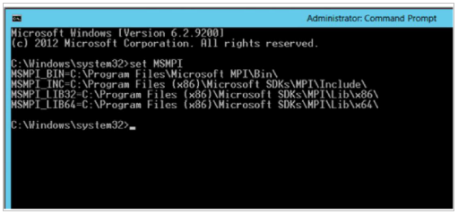
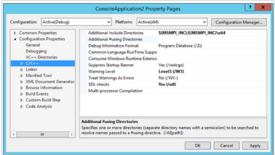
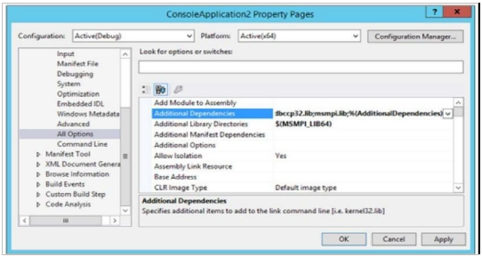
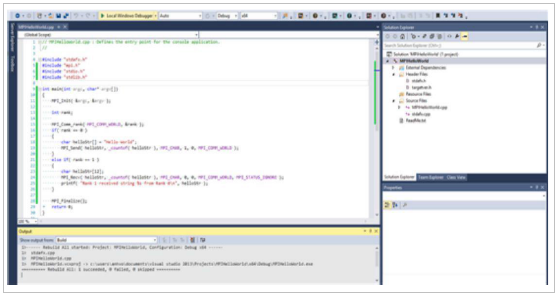

## Message Passing Interface

Use Message passing interface to implement Parallel computing.

To understand use of Message Passing Interface with respect to message passing in clustered computing environment.

The Message Passing Interface (MPI) is an evolving de-facto standard for supporting clustered computing based on message passing. There are several implementations of this standard.

The MPI (Message Passing Interface) is a language-independent communications protocol used to program parallel computers. It allows many computers to communicate with one another. It is used in computer clusters.

Steps to Write MPI Application in Windows
1) Download
          Download MS-MPI SDK and Redist installers and install them. The download link can be found at our homepage
          https://msdn.microsoft.com/en-us/library/bb524831.aspx
          
2) After installation you can verify that the `MS-MPI` environment variables have been set (you will want to use these environment variables in Visual Studio)

3) Download and install `Microsoft VC++ express pack`
          https://www.visualstudio.com/downloads/download-visual-studio-vs
         
4) Open up Visual Studio and create a new Visual C++ Win32 Console Application project. Let’s name it `MPIHelloWorld` and use default settings.

5) Setup the include directories so that the compiler can find the MS-MPI header files. Note that we will be building for 64 bits so we will point the include directory to $(MSMPI_INC);$(MSMPI_INC)\x64. If you will be building for 32 bits please use $(MSMPI_INC);$(MSMPI_INC)\x86

6) Setup the linker lib (notice I have added msmpi.lib to the additional dependencies and also add $(MSMPI_LIB64) to the Additional Library Directories). Note that we will be building for 64 bits so we will point the Additional Library Directories to $(MSMPI_LIB64). If you will be building for 32 bits please use $(MSMPI_LIB32)

7) Code and build program in VC++

8)  Test run the program using `mpiexec` command on the command-line

